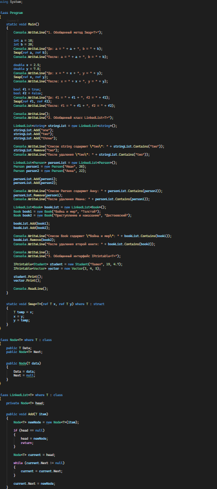
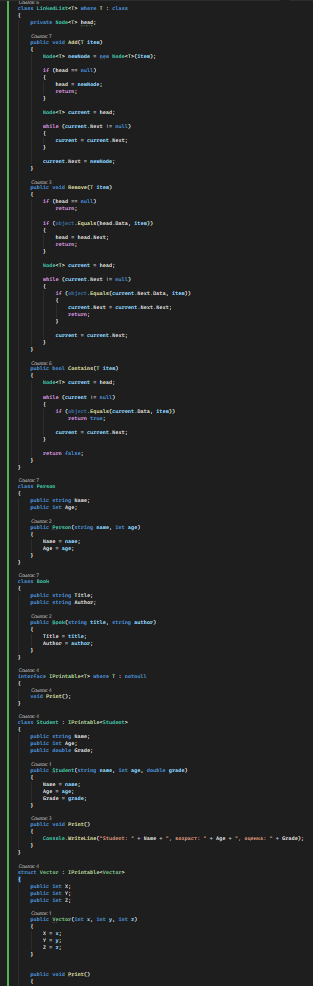
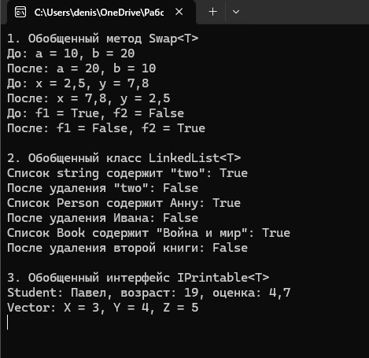

# C# KT11

1. Напишите обобщенный метод Swap<T>(ref T x, ref T y), который меняет местами значения двух переменных типа T. Затем напишите ограничение для этого метода, чтобы он мог работать только с типами, которые являются типами значений (struct). Затем напишите пример вызова этого метода для переменных типов int, double и bool.

2. Напишите обобщенный класс LinkedList<T>, который реализует структуру данных связный список для хранения элементов типа T. Затем напишите ограничение для этого класса, чтобы он мог работать только с типами, которые являются ссылочными типами (class). Затем напишите методы Add(T item), Remove(T item) и Contains(T item), которые добавляют, удаляют и проверяют наличие элемента в списке соответственно. Затем напишите пример использования этого класса для хранения объектов типов string, Person и Book.

3. Напишите обобщенный интерфейс IPrintable<T>, который содержит метод void Print(), который выводит на консоль информацию об объекте типа T. Затем напишите ограничение для этого интерфейса, чтобы он мог работать только с типами, которые являются ссылочными типами (class) или типами значений (struct), но не с указателями (pointer) или динамическими типами (dynamic). Затем напишите классы Student и Vector, которые реализуют этот интерфейс и выводят на консоль свои свойства, такие как Name, Age, Grade, X, Y и Z. Затем напишите пример использования этого интерфейса для печати объектов этих классов.

### Код

### Результат

